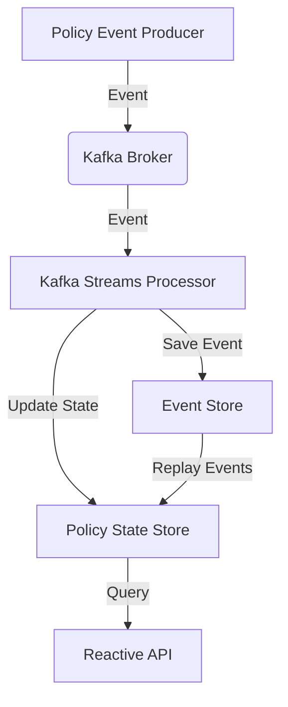

# EventosAUR: Event-Driven Policy Management Prototype

> **Note**: This project is a prototype for insurance policy management using Event-Driven Architecture (EDA) with Kafka and Java WebFlux.

---

## Overview

EventosAUR demonstrates a modern, event-driven approach to managing insurance policies. Built with Kafka Streams and Java WebFlux, it ensures:

- **Current state persistence** for each policy
- **Complete event traceability**
- **State replayability** at any point in time
- **Reactive APIs** for real-time updates and event streaming

---

## Features

- **Event Sourcing**: All policy changes are stored as immutable events.
- **Kafka Integration**: Decoupled, scalable event processing and persistence using Kafka Streams.
- **Reactive APIs**: Built with Java WebFlux for non-blocking, real-time data access.
- **State Reconstruction**: Replay events to rebuild policy state at any moment.
- **Audit & Traceability**: Full event history for compliance and debugging.

---

## Architecture



- **Producers** generate policy events (creation, update, etc.)
- **Kafka** routes events to stream processors
- **Kafka Streams** persist events and update the current state
- **APIs** expose state and event history reactively

---

## Getting Started

### Prerequisites

- Java 17+
- Docker (for Kafka)
- Gradle

### Setup

1. **Clone the repository**

   ```powershell
   git clone <repo-url>
   cd eventosaur
   ```

2. **Start Kafka**

   ```powershell
   docker-compose up -d
   ```

3. **Build and run the application**

   ```powershell
   ./gradlew bootRun
   ```

---

## Usage

- **Produce Events**: Use the API endpoints to create or update policies.
- **Query State**: Retrieve the current state or event history of any policy.
- **Replay Events**: Trigger state reconstruction from the event log.

---

## Configuration

All configuration is managed via `src/main/resources/application.yaml`.

- Kafka connection
- Event store settings
- WebFlux server configuration

---

## Project Structure

- `src/main/java/com/softcaribbean/demo/`  
  Main application code, configs, controllers, services, and infrastructure
- `src/main/resources/`  
  Application configuration files
- `docker-compose.yml`  
  Kafka service definition
- `build.gradle`  
  Build configuration

---

## References

- [Spring WebFlux Documentation](https://docs.spring.io/spring-framework/docs/current/reference/html/web-reactive.html)
- [Kafka Streams Documentation](https://kafka.apache.org/documentation/streams/)
- [Event Sourcing Pattern](https://martinfowler.com/eaaDev/EventSourcing.html)

---

> [!TIP]
> For troubleshooting or advanced configuration, check the `application.yaml` and logs for detailed information.

